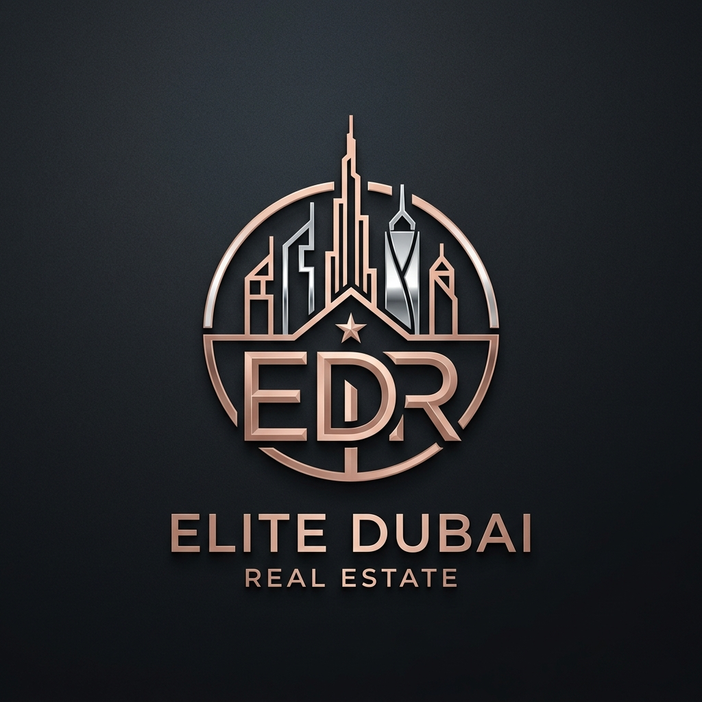

# 🏰 Elite Dubai Real Estate — Ultra-Luxury Web Portal

> **A state-of-the-art, high-end web application for buying, selling, and investing in premier Dubai luxury real estate.**



---

## 🌟 Overview

**Elite Dubai Real Estate** is a boutique luxury real estate web application crafted with cutting-edge front-end technologies and bespoke design aesthetics. Designed specifically for ultra-high-net-worth individuals (UHNWI), family offices, and international investors seeking trophy assets across Dubai (Palm Jumeirah, Downtown Dubai, Dubai Marina, and Business Bay).

---

## ✨ Features & Key Highlights

- **⚜️ Premium Velvet & Gold Aesthetics**: Sleek dark-mode interface (`#07090E`) paired with metallic gold gradients (`#D4AF37`), glassmorphism backdrop blurs, and elegant serif typography (*Cinzel* & *Plus Jakarta Sans*).
- **🎨 AI-Generated Custom Assets**: Includes hyper-realistic architectural photography and a custom-designed rose-gold monogram logo (`img/logo.png`).
- **🪟 Interactive 3D Tilt Effects**: Dynamic 3D perspective mouse tracking on property cards for a tactile, futuristic browsing experience.
- **⚡ Scroll Reveal & Micro-Animations**: Smooth viewport reveal animations driven by native JavaScript `IntersectionObserver` with staggered transition delays.
- **📊 Live Animated Statistics Counter**: Animated numeric tickers highlighting key metrics ($1.5B+ transactions, 100% tax-free, 10-Yr Golden Visa, 8-12% annual yield).
- **🔍 Filterable Catalog & Search Bar**: Instant category switching (*Villas & Mansions*, *Trophy Penthouses*, *Waterfront Apartments*) without page reloads.
- **📍 Prime Location Highlights**: Interactive location showcases for Palm Jumeirah, Downtown Dubai, and Dubai Marina.
- **📱 100% Fully Responsive Layout**: Tailored experience across mobile devices, tablets, and high-resolution desktop displays.
- **🔝 Scroll Progress & Back-to-Top**: Fixed top scroll indicator and dynamic floating navigation button.

---

## 🛠️ Technology Stack

| Layer | Technologies |
| :--- | :--- |
| **Markup & Structure** | HTML5, Semantic Elements, OpenGraph & SEO Best Practices |
| **Styling & System** | CSS3 Vanilla, Custom CSS Variables, Glassmorphism, 3D Transforms |
| **Logic & Interactivity** | JavaScript ES6+, IntersectionObserver API, Dynamic DOM Manipulation |
| **Typography** | Google Fonts (*Cinzel*, *Plus Jakarta Sans*) |
| **Version Control** | Git, GitHub |

---

## 📂 Project Structure

```
elite-dubai-real-estate/
├── index.html        # Main HTML5 entry point with semantic sections
├── css/
│   └── style.css     # Design system tokens, glassmorphism & 3D tilt styles
├── js/
│   └── main.js       # IntersectionObserver, filters, count-up & tilt logic
├── img/
│   ├── logo.png      # High-res Rose Gold & Chrome Emblem Logo
│   ├── villa.png     # Palm Jumeirah Beachfront Mansion photo
│   ├── penthouse.png # Downtown Dubai Sky Penthouse photo
│   └── apartment.png # Dubai Marina Waterfront Residence photo
└── README.md         # Project documentation
```

---

## 🚀 Quick Start & Installation

1. **Clone the repository**:
   ```bash
   git clone https://github.com/vadymVolkov/elite-dubai-real-estate.git
   cd elite-dubai-real-estate
   ```

2. **Open in Browser**:
   Simply open `index.html` in your favorite modern browser (Chrome, Safari, Firefox, Edge):
   ```bash
   open index.html
   ```
   *Alternatively, run a local development server like VS Code Live Server or `npx serve`.*

---

## 📜 License & Copyright

© 2026 **Elite Dubai Real Estate**. All rights reserved. Designed with luxury aesthetic excellence.
